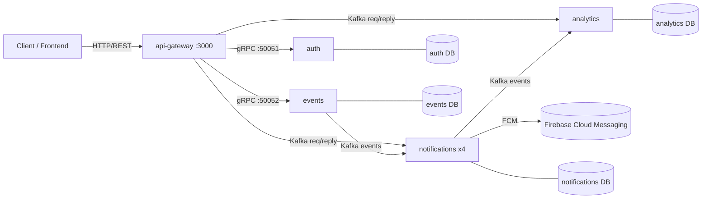
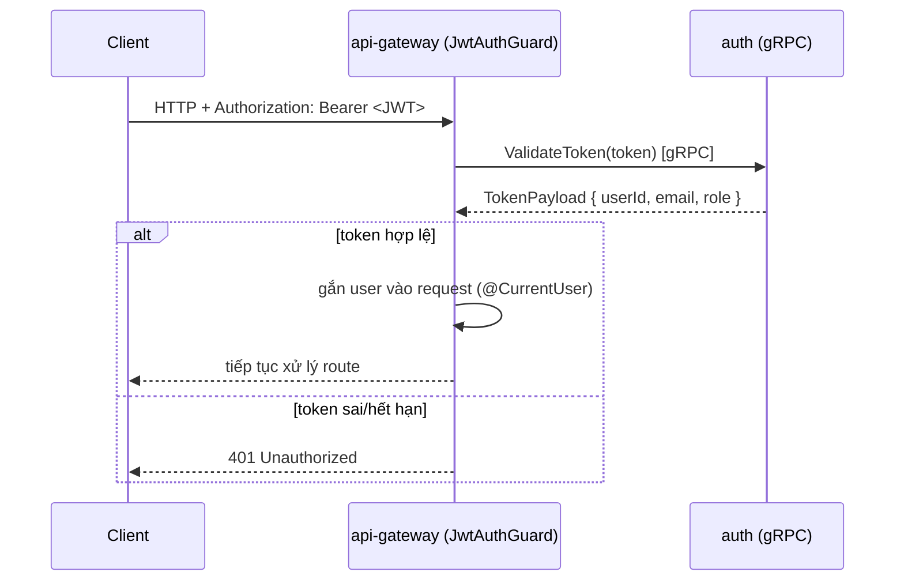
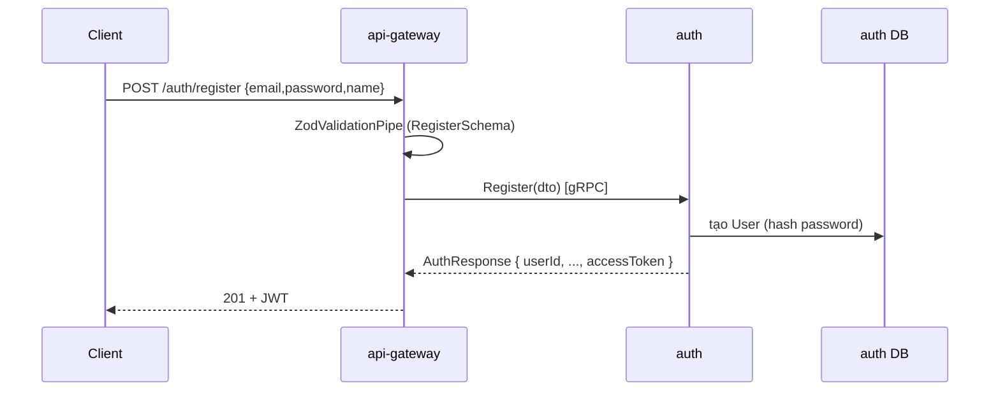
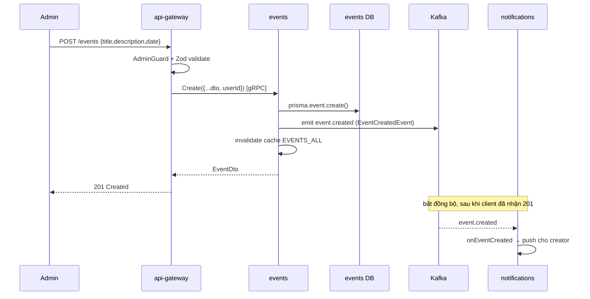
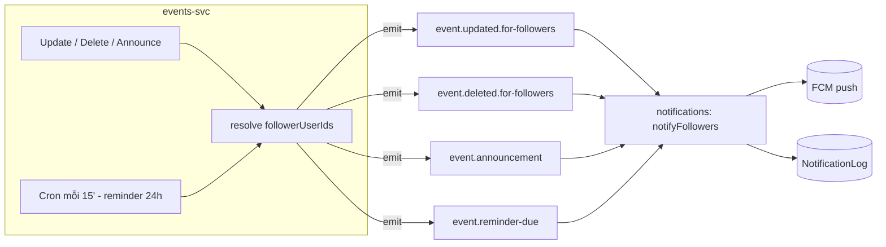
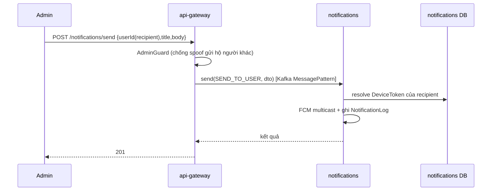
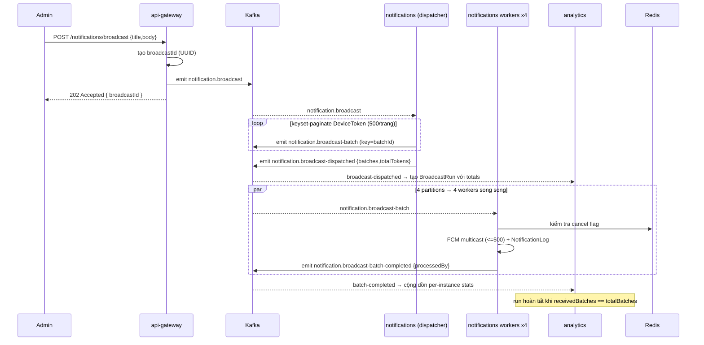
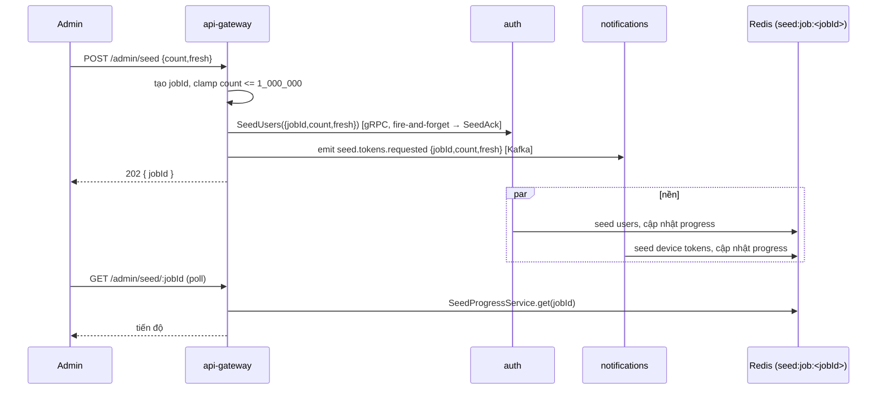

# Flow Document — Events FSA

Tài liệu mô tả **các luồng xử lý (flows)** của hệ thống: từ HTTP request của client
đi qua API Gateway, gọi các microservice qua **gRPC** (đồng bộ) hoặc **Kafka**
(bất đồng bộ), tới push notification qua FCM.

> Bổ trợ cho [`ARCHITECTURE.md`](./ARCHITECTURE.md) (tổng quan services & data
> ownership) và [`INFRA.md`](./INFRA.md) (hạ tầng). File này tập trung vào
> **đường đi của một request/message** qua hệ thống.

---

## 1. Các thành phần & kênh giao tiếp

| Service | Vai trò | Kênh vào | Cổng |
|---|---|---|---|
| `api-gateway` | REST API public, auth guard, cầu nối tới microservices | HTTP | 3000 |
| `auth` | Đăng ký / đăng nhập / JWT / roles / quản lý user | **gRPC server** | 50051 |
| `events` | CRUD event, follow/unfollow, reminder, phát domain event | **gRPC server** + Kafka producer | 50052 |
| `notifications` | Đẩy FCM, device-token registry, broadcast fanout (**4 replicas**) | Kafka consumer | — |
| `analytics` | Lưu lịch sử broadcast run theo instance | Kafka consumer | — |
| `frontend` | Web admin/client | HTTP | 32141 |

**Hai loại giao tiếp:**

- **gRPC (đồng bộ, request/response)** — Gateway ↔ `auth`, Gateway ↔ `events`.
  Dùng khi cần kết quả trả về ngay (login, tạo event, đọc dữ liệu).
- **Kafka (bất đồng bộ, event-driven)** — Gateway → `notifications`/`analytics`,
  và `events` → `notifications`. Dùng cho việc "phát đi rồi quên"
  (fire-and-forget) và fanout khối lượng lớn.



> **Lưu ý:** mỗi service sở hữu DB riêng (database-per-service). Không service nào
> đọc bảng của service khác — dữ liệu chéo luôn đi qua payload của gRPC/Kafka.

---

## 2. Cơ chế xác thực (Auth guard) — áp cho mọi request

Mọi endpoint (trừ `@Public()`: `/health`, `/auth/register`, `/auth/login`) đều
qua guard ở gateway:



- `AdminGuard` chạy sau đó cho các route admin, kiểm tra `role === 'admin'` → nếu
  không thì `403`.
- `@CurrentUser()` inject `TokenPayload` vào controller; `userId` được lấy từ token,
  **không** tin `userId` do client gửi.

---

## 3. Flow: Đăng ký & Đăng nhập (gRPC đồng bộ)



- Login tương tự: `POST /auth/login` → `authGrpc.login()` → so khớp mật khẩu →
  trả `accessToken` (JWT).
- Bước gọi gRPC: `apiGatewayService.register()` → `firstValueFrom(authGrpc.register(dto))`.
  `authGrpc` lấy từ `authClient.getService('AuthService')` trong `onModuleInit()`.

**File liên quan:** `api-gateway.controller.ts` → `api-gateway.service.ts` →
(gRPC) → `auth/auth.controller.ts` (`@GrpcMethod`) → `auth/auth.service.ts`.

---

## 4. Flow: CRUD Event + phát domain event (gRPC + Kafka)

Tạo event là **admin-only**. Đây là ví dụ điển hình kết hợp cả 2 kênh: gateway
gọi `events` qua **gRPC** để ghi DB và nhận kết quả; `events` sau đó **tự phát
Kafka event** cho các service quan tâm.



**Các thao tác event khác:**

| REST | gRPC method | Kafka phát ra | Ghi chú |
|---|---|---|---|
| `POST /events` | `Create` | `event.created` | admin-only |
| `GET /events` | `FindAll` | — | gắn cờ `isFollowing` theo caller; cache `EVENTS_ALL` |
| `GET /events/me` | `FindFollowedByUser` | — | event user đang follow |
| `GET /events/:id` | `FindOne` | — | cache theo từng event |
| `PUT /events/:id` | `Update` | `event.updated` + `event.updated.for-followers` | admin-only |
| `DELETE /events/:id` | `Delete` | `event.deleted` + `event.deleted.for-followers` | resolve followers **trước khi** xóa (cascade) |
| `POST /events/:id/follow` | `Follow` | — | idempotent (upsert) |
| `DELETE /events/:id/follow` | `Unfollow` | — | |
| `POST /events/:id/announce` | `Announce` | `event.announcement` | admin gửi thông báo tới followers |

> **Follower fanout:** `events` sở hữu bảng `EventFollow` nên nó **tự resolve
> `followerUserIds`** rồi nhét vào payload `EventFollowerNotifyEvent`.
> `notifications` không bao giờ query DB của `events`.

**File liên quan:** `events/events.controller.ts` (`@GrpcMethod`) →
`events/events.service.ts` (Prisma + `producer.emit`) → cache `redis-cache.service.ts`.

---

## 5. Flow: Thông báo cho followers (Kafka event-driven)

Nhiều hành động (update/delete/announce/reminder) đều tạo ra cùng một shape
`EventFollowerNotifyEvent` trên các topic khác nhau, và `notifications` xử lý
tất cả bằng một hàm chung `notifyFollowers()`.



**Reminder (nhắc lịch tự động):** `events-reminder.service.ts` chạy `@Cron('*/15 * * * *')`,
tìm event có `date` trong khoảng ~24h tới và `reminderSentAt = null`, phát
`event.reminder-due`, rồi stamp `reminderSentAt` để không gửi lại lần nữa.

---

## 6. Flow: Gửi push cho một user cụ thể (Kafka request/reply)



- Đây là **Kafka request/reply** (`client.send(...)`), khác với broadcast là
  fire-and-forget (`client.emit(...)`).
- Gateway phải `subscribeToResponseOf(SEND_TO_USER)` trong `onModuleInit()` để
  nhận reply.

**Đăng ký device token:** `POST /notifications/register-token` →
`send('notifications.register-token', {userId, token, platform})` → lưu vào
bảng `DeviceToken`.

---

## 7. Flow: Broadcast tới TẤT CẢ user (dispatcher + worker + analytics)

Đây là flow phức tạp và quan trọng nhất — thiết kế để **không process nào phải
load toàn bộ device token vào RAM**. Gồm 4 bước: gateway → dispatcher →
worker pool (4 replicas) → analytics.



**Các điểm mấu chốt:**

- **Dispatcher vs worker** (`notifications.service.ts`): `broadcast()` chỉ phân
  trang + phát batch event; `onBroadcastBatch()` mới thực sự gửi FCM. Crash giữa
  chừng chỉ redeliver batch bị ảnh hưởng, không phải cả broadcast.
- **Song song hóa** đến từ Kafka consumer group + topic có **4 partitions**
  (`KAFKA_NUM_PARTITIONS`), `batchId` là message key để chia đều 4 worker replicas.
- **Instance attribution:** mỗi worker stamp `processedBy = INSTANCE_ID ?? hostname`
  → analytics hiển thị instance nào xử lý batch nào.
- **Xác định hoàn tất:** analytics biết run xong khi `receivedBatches === totalBatches`
  (deterministic), không dựa vào timeout.
- **Delivery semantics:** at-least-once — batch redeliver có thể tạo log trùng,
  được chấp nhận.

### Theo dõi & hủy broadcast

| REST | Đi tới | Kênh |
|---|---|---|
| `GET /notifications/broadcast-runs` | `analytics` LIST_BROADCAST_RUNS | Kafka req/reply |
| `GET /notifications/broadcast-runs/latest` | `analytics` GET_LATEST_BROADCAST_RUN | Kafka req/reply |
| `GET /notifications/broadcast-runs/:id` | `analytics` GET_BROADCAST_RUN (per-instance stats) | Kafka req/reply |
| `POST /notifications/broadcast-runs/:id/cancel` | emit `notification.broadcast-cancelled` | Kafka emit |

Khi hủy: `notifications` set **Redis cancel flag** (dispatcher + workers ngừng
gửi), `analytics` đánh dấu run là cancelled.

---

## 8. Flow: Seed dữ liệu (dev/load-test)

Một job seed chạy song song trên 2 service, cùng báo tiến độ vào **một Redis
progress hash** mà UI poll.



---

## 9. Bảng tổng hợp Kafka topics

Định nghĩa tại `libs/shared/src/kafka.contracts.ts`.

| Topic | Producer | Consumer | Kiểu |
|---|---|---|---|
| `event.created` | events | notifications | emit |
| `event.updated` / `event.deleted` | events | (domain log) | emit |
| `event.updated.for-followers` | events | notifications | emit |
| `event.deleted.for-followers` | events | notifications | emit |
| `event.announcement` | events | notifications | emit |
| `event.reminder-due` | events (cron) | notifications | emit |
| `notification.broadcast` | gateway | notifications (dispatcher) | emit |
| `notification.broadcast-batch` | notifications (dispatcher) | notifications (workers) | emit |
| `notification.broadcast-dispatched` | notifications (dispatcher) | analytics | emit |
| `notification.broadcast-batch-completed` | notifications (workers) | analytics | emit |
| `notification.broadcast-cancelled` | gateway | notifications + analytics | emit |
| `seed.tokens.requested` | gateway | notifications | emit |
| `NotificationsPatterns.SEND_TO_USER` / `FIND_BY_USER` / `FIND_ALL` | gateway | notifications | send (req/reply) |
| `AnalyticsPatterns.*_BROADCAST_RUN(S)` | gateway | analytics | send (req/reply) |

---

## 10. Các file config & cách chạy

**Config gRPC:**
- `libs/shared/src/grpc-config.ts` — `grpcClientConfig()`, `protoPath()`, loader options.
- `libs/shared/src/proto/auth.proto`, `events.proto` — contract (service + messages).
- `libs/shared/src/{auth,events-svc}.contracts.ts` — package/proto constants + typed client interfaces.
- `apps/{auth,events}/src/main.ts` — bootstrap gRPC **server**.
- `apps/api-gateway/src/api-gateway.module.ts` — đăng ký gRPC **client**.

**Config Kafka:** `libs/shared/src/kafka-config.ts` (client config, service tokens),
`kafka.contracts.ts` (topics + payload shapes).

**Chạy local:**
```bash
npm install
npm run prisma:generate      # bắt buộc, tránh lỗi "prisma errors"
npm run start:all            # gateway + auth + events + notifications
```

**Chạy bằng Docker (đã set sẵn ports/URLs qua env):**
```bash
npm run docker:up:dev        # docker-compose.dev.yml
```

Xem chi tiết ports/env/replicas ở [`INFRA.md`](./INFRA.md).

---

_Sinh tự động từ source (controllers, services, `.proto`, kafka contracts).
Khi thêm/sửa RPC hoặc Kafka topic, cập nhật cả `.proto`/`kafka.contracts.ts`
lẫn file này để giữ đồng bộ._
